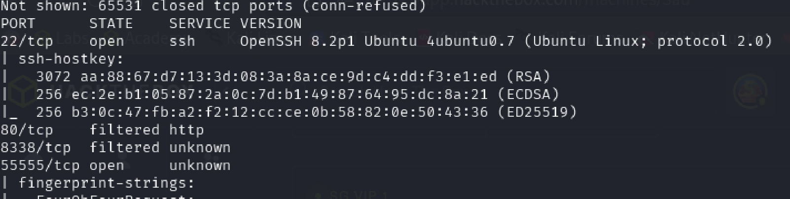
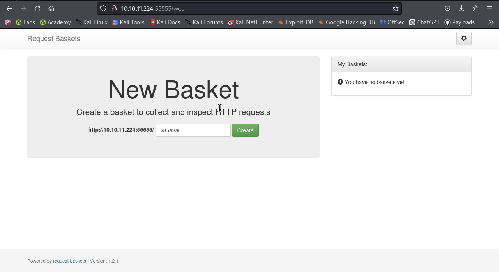

# Sau Writeup
## About Sau
`Sau` is an Easy Difficulty Linux machine that features a `Request Baskets` instance that is vulnerable to Server-Side Request Forgery (SSRF) via `[CVE-2023-27163](https://nvd.nist.gov/vuln/detail/CVE-2023-27163)`. Leveraging the vulnerability we are to gain access to a `Maltrail` instance that is vulnerable to Unauthenticated OS Command Injection, which allows us to gain a reverse shell on the machine as `puma`. A `sudo` misconfiguration is then exploited to gain a `root` shell.
## Walkthrough
### Enumeration
I used nmap to enumerate open ports by (`-oA` to save the results):
```bash
nmap 10.10.11.224 -sC -sV -oA nmap -p-
```

Port 20 and 55555 are open, and 80, 8338 are filtered.

I first navigate to port 55555 first (it is more suspicious to me...)
