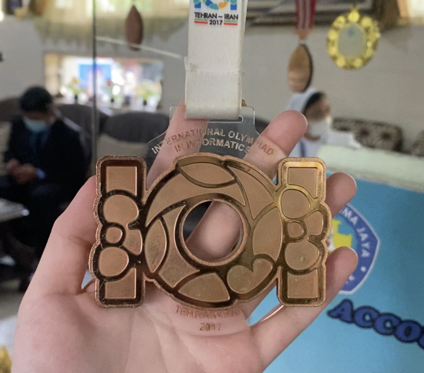
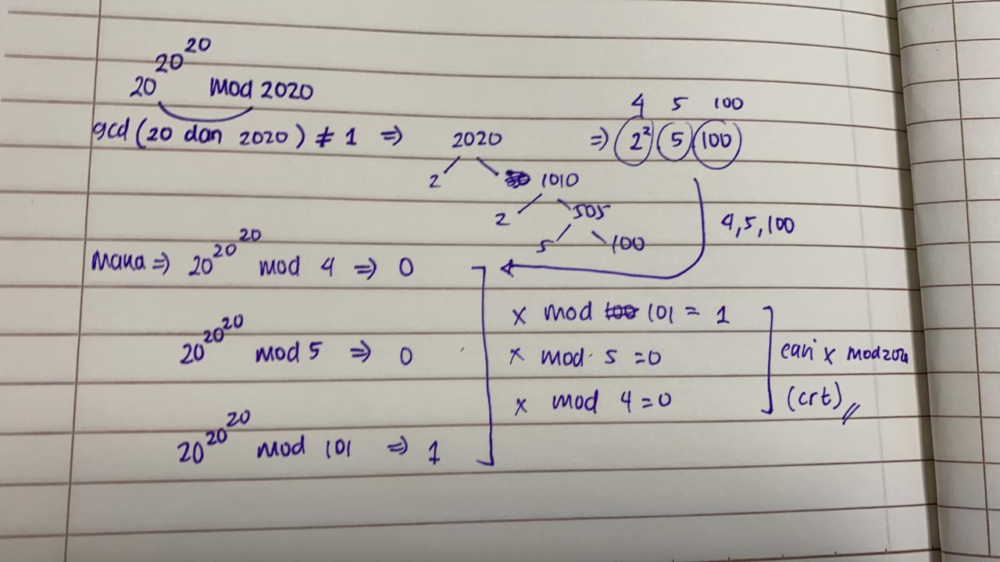
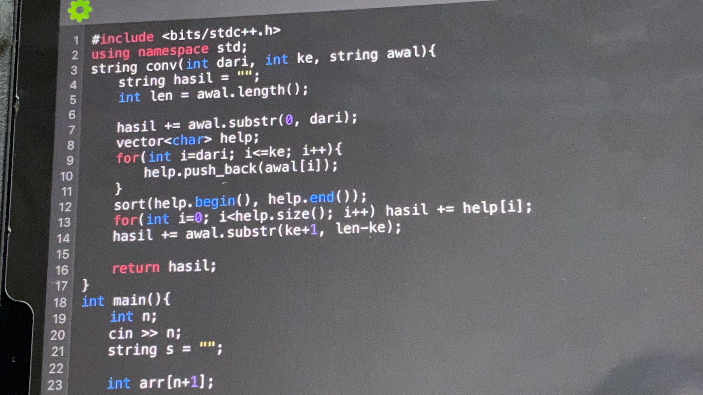
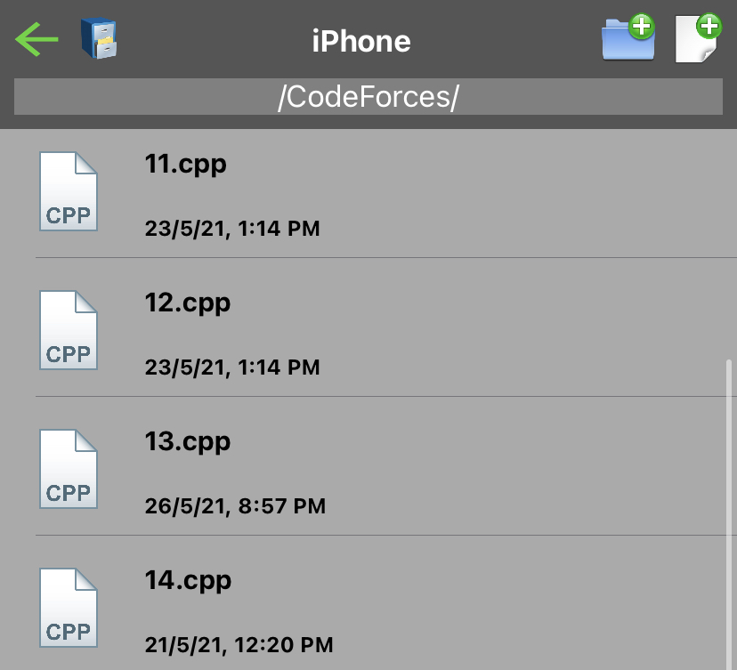
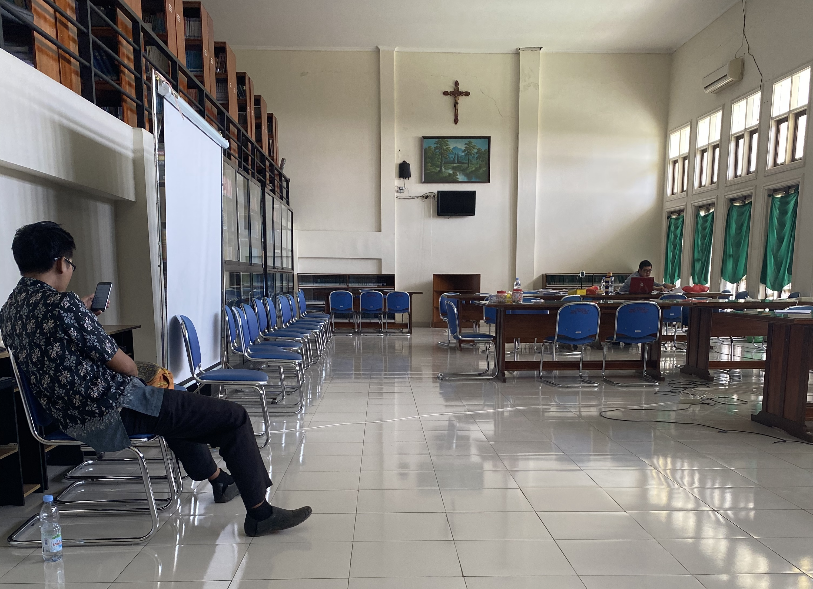
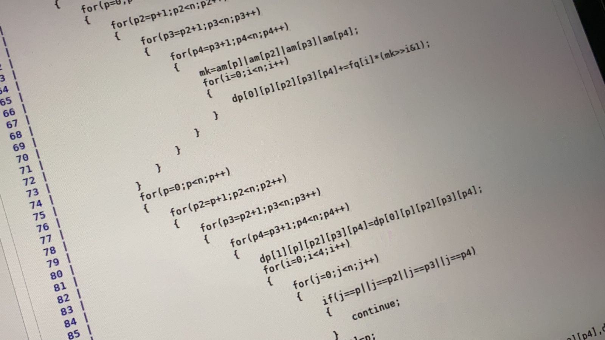
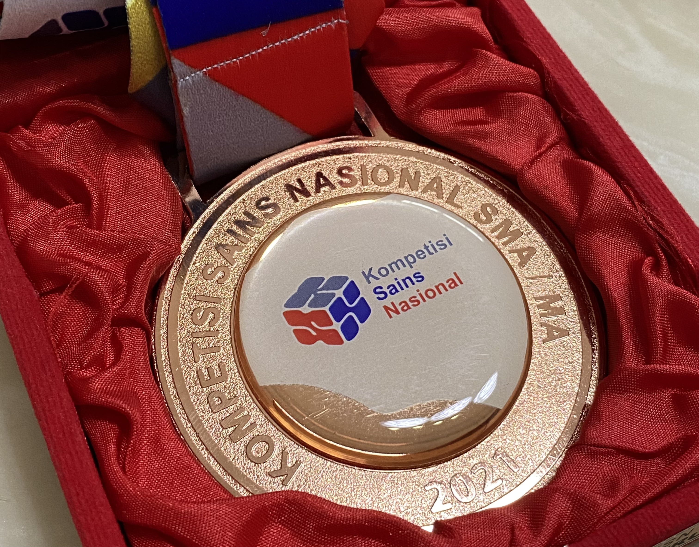
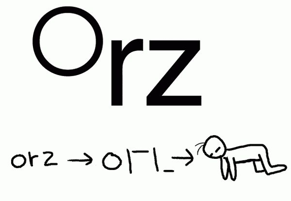

# IDN NOI (OSN Informatika) 💻
tiny bit of my OSN Informatika experience
<!-- more -->
Hi, if you're going to participate in OSN/NOI/equivalent, I hope by reading this will motivate you! If not, please don't be discouraged or anything, just take the positive part!

## About OSN/NOI 👀
NOI in Indonesia is called OSN Informatika. We have 3 rounds, which are OSK (regency), OSP (province), and lastly OSN (national). Those who passed OSK will compete in OSP, and top 100 students from OSP, will compete in OSN. OSN has 30 medalists (5 gold, 10 silver, 15 bronze). Back then, OSK consists of Multiple Choice questions, mainly ask about logic and basic maths, a little bit of reading pseudocodes. OSP is a mix of OSK and OSN. It has math MCQ questions, and few coding questions (each qn has like 2 subtask). And lastly, OSN only consists of coding questions, and has 100 participants from different provinces.

  

    <a href="osn/4.jpg" class="lightbox">
      
      
Senior's IOI Medal

    </a>
  

  
<!-- 

    

 -->

## Motivation 💅
I started my OSN journey when I was in grade 10. What motivated me was my senior, who won like 5 years before my NOI year. I heard from my teacher that he got freepass to NUS because he is an IOI medalist. I've always wanted to go to SG for uni 🤝🤝. Knowing that it will be very hard for me to be accepted in SG uni without any certificate, I decided to study for NOI/OSN. At first, I wanted to do OSN Math, instead of informatics, since I had no idea about programming back then and I also had no one to teach me. 

  

    <a href="osn/6.jpg" class="lightbox">
      
      
Math scratches in my gallery

    </a>
  

## How It Went 💪
July 2020, I began my journey by learning mathematics, since I initially wanted to do Math OSN. But I didn't know any websites or resources related to OSN syllabus, so I literally study blindly (yes, I even remember I studied like bachelor-masters level math major syllabus 🤧🤧). I still remember how much unrelated and unimportant stuff I had studied (and now I already forget everything 🤡💩...). Then, after like 2 months? my teacher asked me to move to Informatics, so I did. Yet, I still studied maths, and started to solve OSK Informatics past year papers (which is basic maths). Thats how I spent like 6 first months (kinda sad I wasted so much time 🤌). I was on the wrong track, but slowly I knew more about what to expect and study, and most importantly, gained friends. 

Then, I learned about TLX, an Indonesian platform for Competitive Programming ([my TLX profile](https://tlx.toki.id/profiles/GabriellaG)). I realized that NOI won't be that easy, and my coding skill is really,.. behind. Look, even my `hello world` [first submission](https://tlx.toki.id/submissions/786351) returns Compilation Error. Sadly,I also did not have any compatible laptop/PC, so I used to code on my phone/ipad 😬😬 (there is an [C/C++ Compiler app](https://apps.apple.com/id/app/c-c-programming-compiler/id1160868782?l=id) in AppStore). Back then I thought it was normal, and not that bad (now that I think of it, I was crazy 🤦‍♀️🤡🤡). And then, TLX used to be down in my ipad & phone, so I had to borrow my sis' laptop, took photos of the problems, and sent my submission through email each time I need to submit something 😓. But I must say, I am very thankful for my past self, for not giving up HAHAHA 🙏🙏🙏 (sadly because of it, my typing speed is very slow). After knowing TLX, thats when I started to learn more about what is actually tested in OSN/NOI (finally). 

  

    <a href="osn/1.JPG" class="lightbox">
      
      
Code on ipad

    </a>
  

But, I was too scared for OSK, so I still prepare & study more maths than coding everyday 😭😭. I did all past years' OSK, even to the point that I already memorized all the questions (I re-did them too many times 😶‍🌫️). Then, finally OSK day came. That day, my coding skills were still very bad, but I didn't really think of it, since I need to pass OSK first. I think it was in mid June 2021. OSK in my year was so hard, I felt like what I have prepared, for almost a year, result in vain. However, very fortunately, I passed it (yay). The result was out around my birthday (18 June) as if it was my bday present 🎁. I thought I was fortunate enough to pass it, not because of my skill, but pure luck. I realized OSK only need you to 'pass' it, but won't contribute much to you winning OSN. I soon regretted spending so much time on OSK stuff, like I should've just did more coding 🙃🙃.

  

    <a href="osn/3.jpg" class="lightbox">
      
      
Phone C/C++ Compiler App

    </a>
  

Right after OSK, I grinded my coding skills knowing that I can't waste any time and I can't afford breaks 😢. When I first saw OSN question, wow, I didn't even understand the question 😁😁😁?? Every question I saw was soo complicated, that I began to think if it is possible for me to win 😀. I had like 2 months before OSP, and 5 months before OSN. It hit me hard, but I can't give up everything I've done. Everyday I just watch algorithms from YouTube, and did TLX questions. I also read several books, like Competitive Programming by Steven Halim, and discovered a 3000-pages DP book, with classical DP solutions there. Then, I discovered Codeforces, AtCoder, Vjudge, CSES, and other online judges. I began practicing there also, aside from TLX. I still remember vividly, how I can't even solve 800-rated questions in Codeforces. Language was also a barrier for me (there are technical vocabularies that I didn't know 😟😟, e.g, `consecutive`, `lexicographic`, `concatenate`, `adjacent`, etc...), I remember how much I used google translate. Each day was just practice and practice, I got very little sleep since I needed to wait for my family to sleep (It is hard for me to focus studying if there is any sound, until now sadly 😭😭) to fully study, and wake up to go to school at 7am. I constantly felt sleepy, and thats how my sleep schedule went downhill. 6 hours of sleep was already a luxury AHAHAHA. I just sleep in class sometimes 🤩, if no one was teaching, to pay for my lost sleep 🤡.

Knowing that Codeforces problems are still too hard for me, I went back to TLX to learn the basics. And slowly, I did some CF and AtCoder as I gained more confidence 💪. Things became easier after I learned the basic coding and algos. I started to do OSP and OSN questions, and higher rated problems in CF and AtCoder 😎😎. Time passed very fast, and I did OSP quite well. Although I left some questions unsolved, it did not cause me too much stress, unlike OSK. I had a strong feeling that I would pass. OSP result was out, and I was in disbelief, that I will participate in OSN (meaning Top 100)! I thought like wow, my OSK self won't believe me but look here I am MUAHAHAH 🫣🫣💅! My grind did not end there, I still needed to win OSN (IOI in 10th grade was my goal, so I had to get a medal) 🫡. 

  

    <a href="osn/5.jpg" class="lightbox">
      
      
OSN Day (Online)

    </a>
  

After OSP, I did more advanced problems and algos to prepare for OSN (DSU, graphs, especially DFS are my fav 💕, and greedy is least fav 🤮). I finally finished TLX courses questions, and fully moved to Codeforces, Vjudge, and Atcoder for practice. I learned alot from CSES problemset, AtCoder Educational DP, and Codeforces Edu, also by doing normal contest problemsets. Still, doing OSN problems are very important. My mistake was, I thought I were very stupid to solve OSN problems HAHAHA (although its true, but still need to do it 😀😀). I did not do much OSN problems, which is bad, since CF & Atcoder problems are different in syllabus and format. 8 November 2021, OSN day finally came, yet number of OSN problems that I fully did, probably was less than 5 (lmao 🥴). But I guess, the practice in other platforms still help alot 😇! 

  

    <a href="osn/7.jpg" class="lightbox">
      
      
Random DP Code

    </a>
  

Since I knew that OSN problems were indeed hard to AC (fully solve), I just targeted to get as much points from doing subtasks 💅. In OSN, we can view the leaderboard (freeze after 4th hour), so I was quite confident that I'll get a medal by seeing the leaderboard. And that's how I get a bronze medal 🥳🥳. Although it was just bronze, I was very very happy, knowing that my effort did not go to waste (I still feel stupid, though). Yet my journey did not end there, I still had Pelatnas (Pelatihan nasional / National Training) to do. After winning OSN, I bought my current laptop since I need 5-hour screen record for contest in Pelatnas. I then realized HOW MUCH IT WILL HELP ME IF I BOUGHT IT EARLIER, I swear 🤡🤡🤡... Now I can't go back and code in ipad/phone after getting a laptop 🫠.

  

    <a href="osn/2.jpg" class="lightbox">
      
      
My Medal

    </a>
  

## Lessons from the Ride 👌
1) Don't spend so much time on OSK (luckily, I still managed to rush coding part, but please don't worry too much about OSK and move on to coding!!).  
2) Don't give up, just give it a try, you'll thank yourself 🎀. Even in the worst case, if you try, you'll at least learn something. 
3) Do more OSN questions to familiarize with the format. 
4) Don't compare yourself with others, appreciate your progress and compare with your past self instead. 
5) Please consider buying a laptop/PC to code if possible 😔. 
6) Find friends to compete with 😋. 
7) Winning OSN is not an end, coding is a lifelong learning.

  

    <a href="osn/8.jpg" class="lightbox">
      
      
orz

    </a>
  

## Resources 🙌
1) [OSN TOKI Website](https://osn.toki.id/) 
2) [TLX](https://tlx.toki.id/) 
3) [Codeforces](https://codeforces.com/) 
4) [AtCoder](https://atcoder.jp/) 
5) [Virtual Judge](https://vjudge.net/) 
6) [CSES Problemset](https://cses.fi/problemset/) 

