# Highschool - My Experience

The purpose of this page mainly is to keep my pictures and memories with my friends during highshool.
<!-- more -->
I attended [Rajawali Catholic High School](https://smarajawalimakassar.sch.id/school-sma/) in Makassar for my high school education, starting in June 2020 during the COVID-19 era. High school in Indonesia, known as SMA (Sekolah Menengah Atas) or SMK (Sekolah Menengah Kejuruan) for vocational tracks, typically lasts three years, from grades 10 to 12. It follows junior high school (SMP) and allows students to specialize in a field of study during grade 11 by choosing between IPA (sciences), IPS (social sciences), or less commonly, Bahasa (languages). Vocational schools (SMK) focus on career-oriented skills.

Education in SMA is more academic, preparing students for university, while SMK focuses on practical skills for immediate employment. National exams were traditionally used for graduation and university entrance, though recent reforms emphasize broader assessments.

Here are pictures of me and my friends 🐣!

  <a href="14.JPG" class="lightbox">
    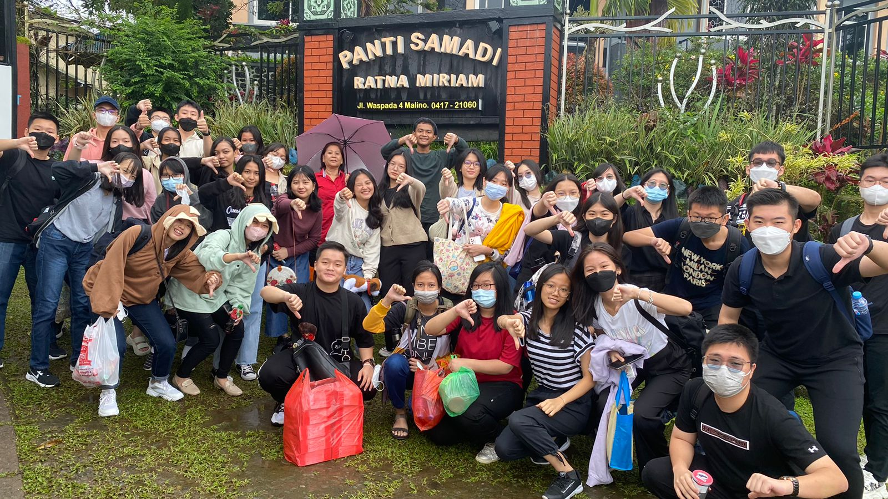
  </a>
    
  
    
    
  
  
    <a href="87.JPG" class="lightbox">
    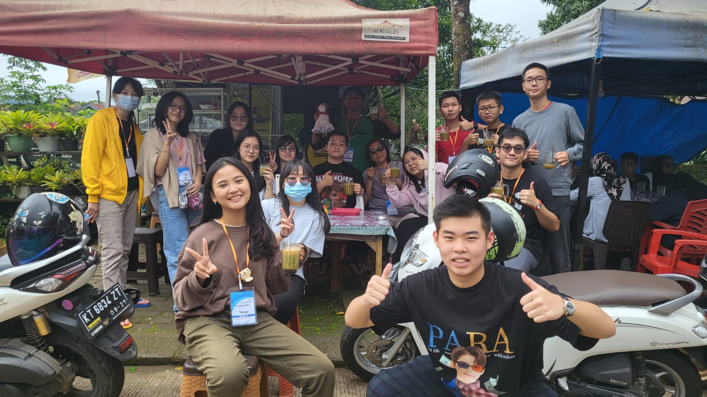
  </a>
  
      <a href="85.JPG" class="lightbox">
    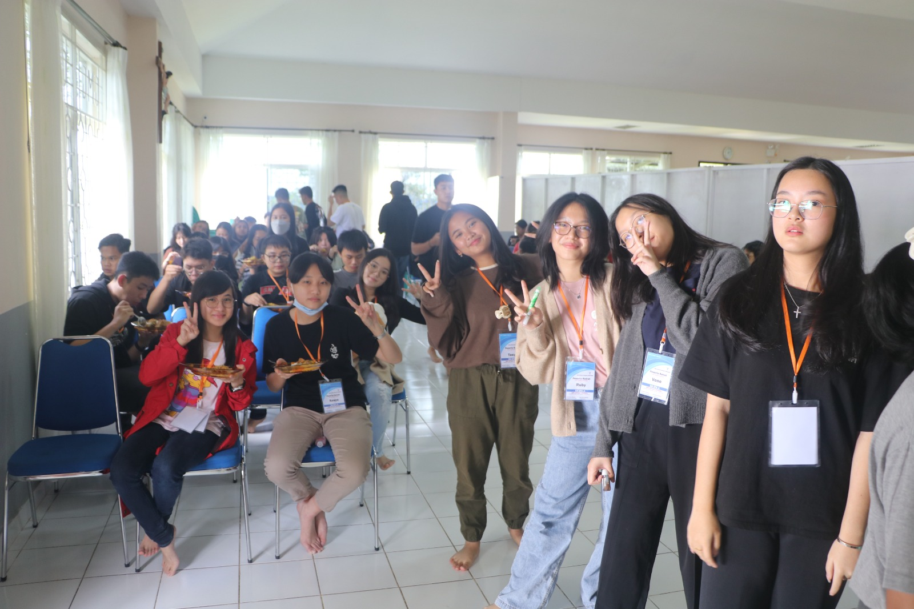
  </a>
  
      
  
  
  <a href="3.JPG" class="lightbox">
    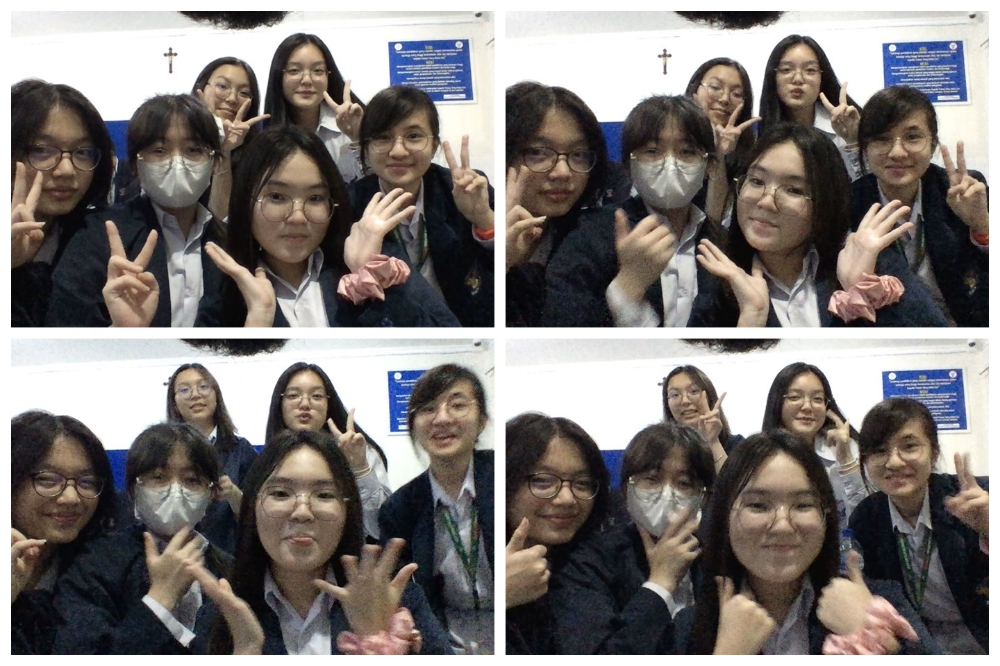
  </a>
    
    
    
    <a href="7.JPG" class="lightbox">
    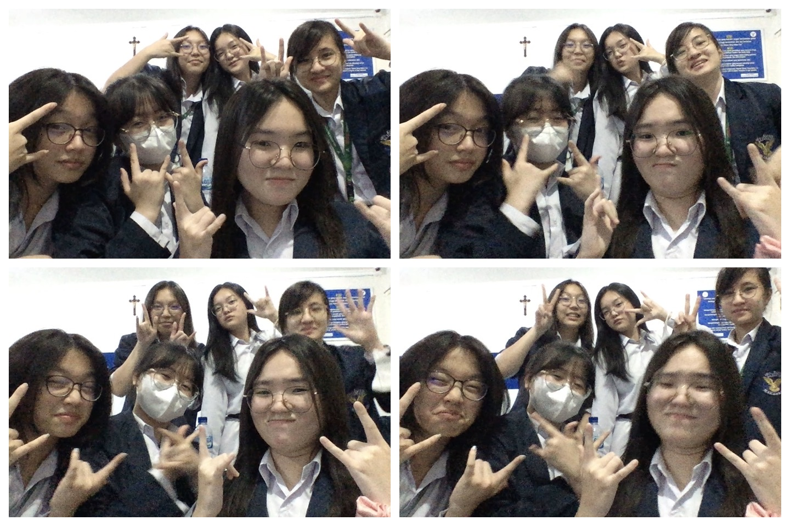
  </a>
    
  <a href="9.JPG" class="lightbox">
    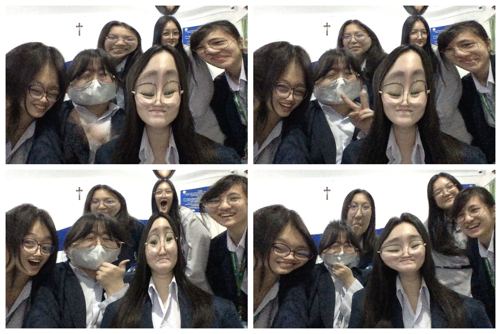
  </a>
    
    </a>
    
    </a>
    

  </a>
    
    
    
    
    
    
  </a>
    
  </a>
    
  
    
    
  <a href="19.JPG" class="lightbox">
    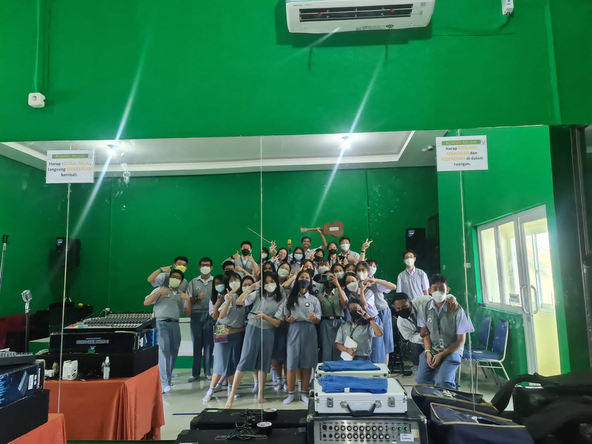
  </a>
  
  <a href="22.JPG" class="lightbox">
    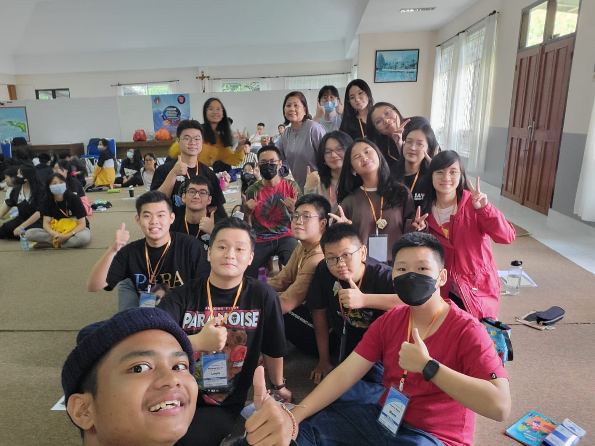
  </a>
  <a href="23.JPG" class="lightbox">
    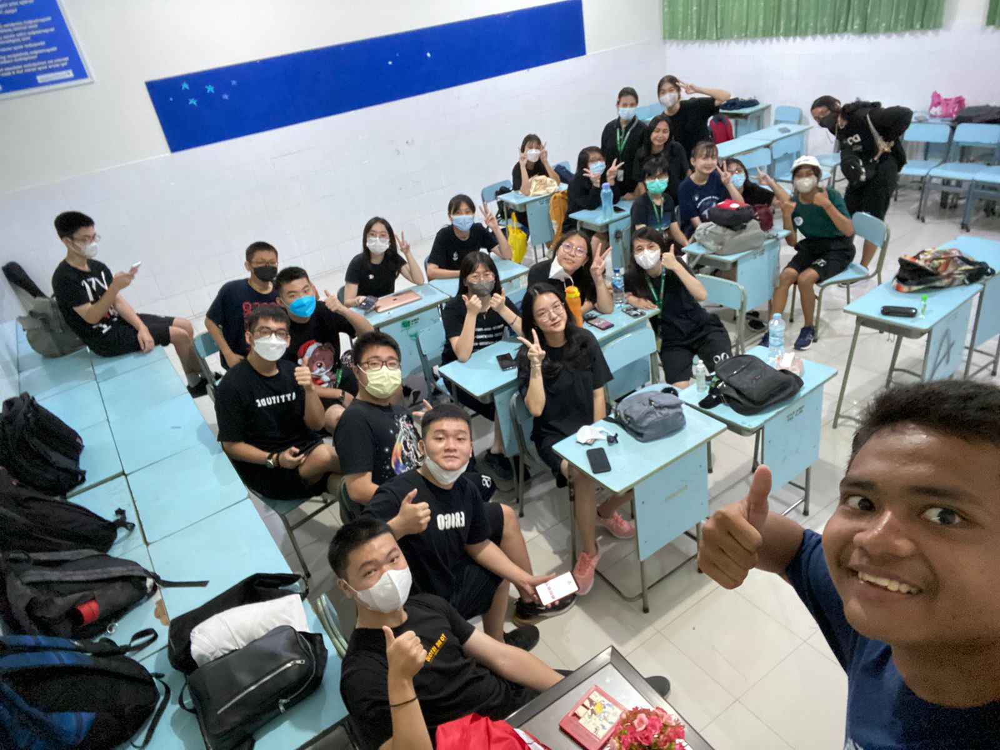
  </a>
  
  
  
  
  
  
  
  
  
      
  
  
  
  
  
  
  
  
  
  
  
  
  
  </a>
    
    
    
  
  </a>
    
  </a>
    
  </a>
    
  </a>
    
  </a>
    
    
  </a>
    
  </a>
    
  </a>
    
  </a>
    
  </a>
    
  </a>
    
  </a>
    
  </a>
    
  
  </a>
    
  </a>
    
  </a>
    
    
  
  
    <a href="37.JPG" class="lightbox">
    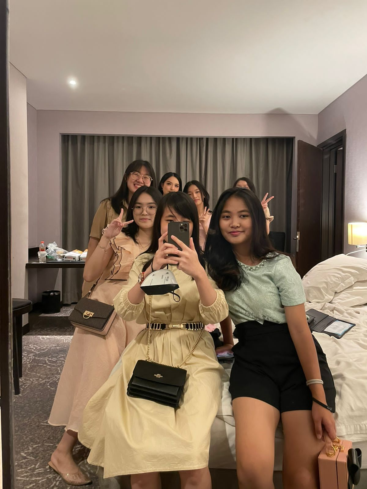
  </a>
  <a href="33.JPG" class="lightbox">
    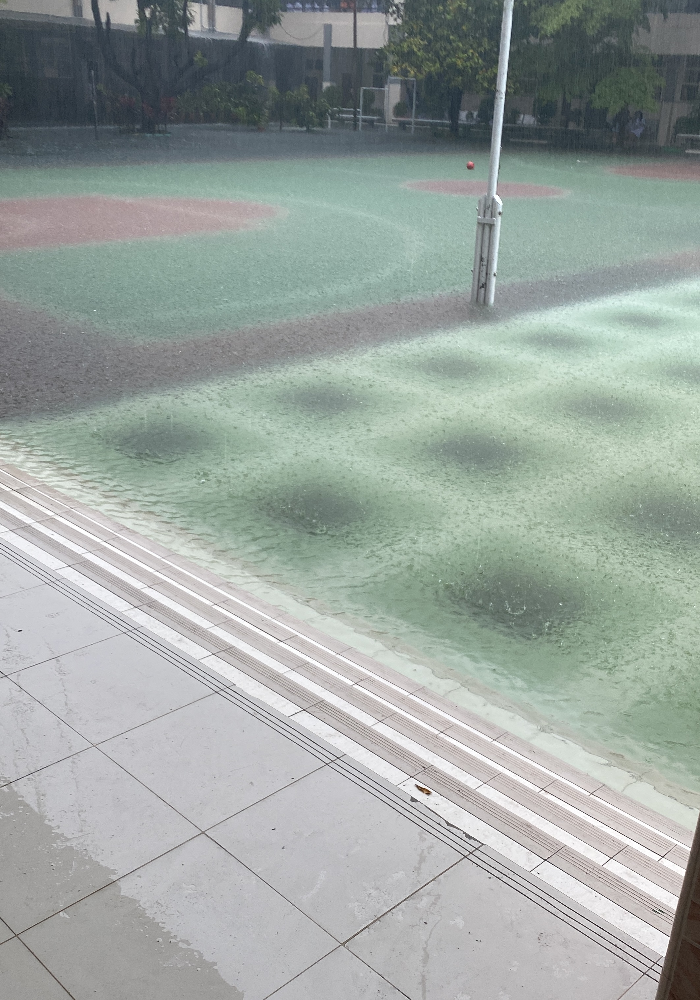
  </a>
  
  
  
    
      
    

